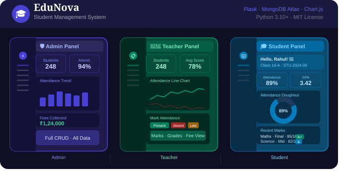
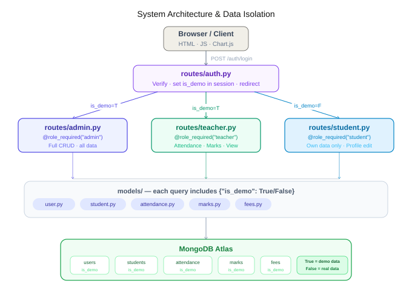

# 🎓 EduNova — Student Management System

**A production-ready, full-stack School Management System**
**Three completely separate panels: Admin · Teacher · Student**

[](https://python.org)
[](https://flask.palletsprojects.com)
[](https://cloud.mongodb.com)
[](https://developer.mozilla.org)
[](https://chartjs.org)
[](LICENSE)

</div>

---

## 📋 Table of Contents

- [Overview](#-overview)
- [Screenshots](#-screenshots)
- [Features](#-features-by-panel)
- [Tech Stack](#-tech-stack)
- [Quick Start](#-quick-start)
- [Demo Credentials](#-demo-credentials)
- [Project Structure](#-project-structure)
- [How Data Isolation Works](#-how-data-isolation-works)
- [API Reference](#-api-reference)
- [Database Setup](#%EF%B8%8F-database-setup)
- [Deployment](#-deployment)
- [Troubleshooting](#-troubleshooting)
- [Contributing](#-contributing)

---

## 🌟 Overview

EduNova is a complete school management platform built with **Flask** and **MongoDB Atlas**. It provides three fully independent panels — each with its own sidebar, dashboard, routes, templates, and permission set. Demo accounts are completely isolated from real accounts using a smart `is_demo` flag system, so you can explore freely without touching production data.
**Contact :-** [https://portfolio-yxmp.onrender.com/]

---

## 📸 Screenshots

> All panels are live and functional. The screenshots below show the actual UI layout of each panel.
> 
> 

### 🔐 Login Page

The entry point for all three roles — select your role tab, enter credentials, and land on your dedicated panel.

```
┌────────────────────────────────────────────────────────────────┐
│                                                                │
│  ╔══════════════════╗    ╔══════════════════════════════════╗  │
│  ║ 🎓 EduNova       ║    ║  Welcome Back!                   ║  │
│  ║                  ║    ║  Sign in to access your panel    ║  │
│  ║  Three Panels,   ║    ║                                  ║  │
│  ║  One Platform    ║    ║  [Admin] [Teacher] [Student]     ║  │
│  ║                  ║    ║                                  ║  │
│  ║  ─────────────── ║    ║  Email  ______________________   ║  │
│  ║  🛡 Admin         ║    ║  Pass   ______________________   ║  │
│  ║  Full access     ║    ║                                  ║  │
│  ║                  ║    ║  [      Sign In    ──────────►]  ║  │
│  ║  👩‍🏫 Teacher       ║    ║                                  ║  │
│  ║  Mark & grade    ║    ║  Demo: admin@school.com/admin123 ║  │
│  ║                  ║    ╚══════════════════════════════════╝  │
│  ║  🎓 Student       ║                                         │
│  ║  Personal view   ║                                         │
│  ╚══════════════════╝                                         │
└────────────────────────────────────────────────────────────────┘
```

---

### 🛡️ Admin Panel — Dashboard

Full system overview with live stats, attendance trend chart (6 months), fee pie chart, and top-performer rank list.

```
┌───────────────────────────────────────────────────────────────────────┐
│  ╔═══════════╗                                                         │
│  ║ 🎓 EduNova║  Admin Dashboard                      🛡 Administrator   │
│  ║ ─────────║ ─────────────────────────────────────────────────────── │
│  ║ Dashboard ║                                                         │
│  ║ Students  ║  ┌─────────┐  ┌─────────┐  ┌─────────┐  ┌─────────┐  │
│  ║ Teachers  ║  │ 👥 248  │  │ 👩‍🏫 12   │  │📅 94.2% │  │💰 1.24L │  │
│  ║ ─────────║  │Students │  │Teachers │  │Attend.  │  │Collected│  │
│  ║ Attendance║  └─────────┘  └─────────┘  └─────────┘  └─────────┘  │
│  ║ Marks     ║                                                         │
│  ║ Fees      ║  ┌───────────────────────┐   ┌───────────────────────┐ │
│  ║ ─────────║  │ 📈 Attendance Trend    │   │ 🥧 Fee Breakdown       │ │
│  ║ Profile   ║  │  6-month bar chart    │   │  Tuition  65%         │ │
│  ║           ║  │  Present vs Absent    │   │  Exam     20%         │ │
│  ║ [Logout]  ║  └───────────────────────┘   └───────────────────────┘ │
│  ╚═══════════╝                                                         │
└───────────────────────────────────────────────────────────────────────┘
```

---

### 🛡️ Admin Panel — Student Management

Full CRUD with search, class filter, pagination, add/edit/delete modals.

```
┌───────────────────────────────────────────────────────────────────────┐
│  ╔═══════════╗                                                         │
│  ║ Dashboard ║  Student Management           🛡 Administrator          │
│  ║ Students ●║ ─────────────────────────────────────────────────────  │
│  ║ Teachers  ║                                                         │
│  ║ Attendance║  [🔍 Search...]  [Class ▾]  [+ Add Student]            │
│  ║ Marks     ║                                                         │
│  ╚═══════════╝  ┌──────────────────────────────────────────────────┐  │
│                 │ ID          Name         Class   Actions          │  │
│                 │ STU-2024-01 Alice Johnson 10-A   [✏] [🗑]         │  │
│                 │ STU-2024-02 Bob Smith     10-B   [✏] [🗑]         │  │
│                 │ STU-2024-03 Carol White   9-A    [✏] [🗑]         │  │
│                 │ STU-2024-04 David Brown   9-B    [✏] [🗑]         │  │
│                 │ ...                                               │  │
│                 └──────────────────────────────────────────────────┘  │
│                 Showing 10 of 248    [◄] [1] [2] [3] ... [►]          │
└───────────────────────────────────────────────────────────────────────┘
```

---

### 👩‍🏫 Teacher Panel — Dashboard

6-month attendance line chart + subject performance radar chart.

```
┌───────────────────────────────────────────────────────────────────────┐
│  ╔═══════════╗                                                         │
│  ║ 🏫 EduNova║  Teacher Dashboard                      👩‍🏫 Teacher     │
│  ║ ─────────║ ─────────────────────────────────────────────────────  │
│  ║ Dashboard ║                                                         │
│  ║ Students  ║  ┌─────────┐  ┌─────────┐  ┌─────────┐  ┌─────────┐  │
│  ║ ─────────║  │👥 248   │  │📅 92.1% │  │📚 5 Sub │  │📊 78.4% │  │
│  ║ Attendance║  │Students │  │Attend.  │  │jects    │  │Avg Score│  │
│  ║ Marks     ║  └─────────┘  └─────────┘  └─────────┘  └─────────┘  │
│  ║ Fee Status║                                                         │
│  ║ ─────────║  ┌───────────────────────┐   ┌───────────────────────┐ │
│  ║ Profile   ║  │ 📈 6-Month Line Chart │   │ 🕸 Subject Radar       │ │
│  ║           ║  │  Present ──────────── │   │    Math  ●            │ │
│  ║ [Logout]  ║  │  Absent  - - - - - -  │   │  Science  ●           │ │
│  ╚═══════════╝  └───────────────────────┘   └───────────────────────┘ │
└───────────────────────────────────────────────────────────────────────┘
```

---

### 👩‍🏫 Teacher Panel — Mark Attendance

Mark present / absent / late for each student. Bulk actions + save.

```
┌───────────────────────────────────────────────────────────────────────┐
│  ╔═══════════╗                                                         │
│  ║ Dashboard ║  Mark Attendance          Sunday, 1 June 2025          │
│  ║ Students  ║ ─────────────────────────────────────────────────────  │
│  ║ Attendance●║                                                        │
│  ╚═══════════╝  32 Present  │  5 Absent  │  2 Late                    │
│                 [✓ All Present]  [✗ All Absent]  [💾 Save Attendance]  │
│                                                                         │
│                 ┌──────────────────────────────────────────────────┐  │
│                 │ ID          Name         Class   Mark Status      │  │
│                 │ STU-2024-01 Alice Johnson 10-A   [✓Present][✗][⏰]│  │
│                 │ STU-2024-02 Bob Smith     10-B   [✓][✗Absent][⏰] │  │
│                 │ STU-2024-03 Carol White   9-A    [✓Present][✗][⏰]│  │
│                 └──────────────────────────────────────────────────┘  │
└───────────────────────────────────────────────────────────────────────┘
```

---

### 🎓 Student Panel — Personal Dashboard

Personalized welcome, 4 stats cards, recent marks table, attendance doughnut chart.

```
┌───────────────────────────────────────────────────────────────────────┐
│  ╔═══════════╗                                                         │
│  ║ 👤 EduNova║  My Dashboard                            🎓 Student     │
│  ║ ─────────║ ─────────────────────────────────────────────────────  │
│  ║ Dashboard ║                                                         │
│  ║ Profile   ║  ╔═══════════════════════════════════╗  ┌───────────┐  │
│  ║ ─────────║  ║ 🌊 Hello, Rahul! 👋               ║  │ Student ID │  │
│  ║ Attendance║  ║ Class 10-A · Male                 ║  │STU-2024-09│  │
│  ║ Marks     ║  ╚═══════════════════════════════════╝  └───────────┘  │
│  ║ Fees      ║                                                         │
│  ╚═══════════╝  ┌─────────┐  ┌─────────┐  ┌─────────┐  ┌─────────┐  │
│                 │📅 89.5% │  │⭐ 3.42  │  │📚 5     │  │💰 ₹5000 │  │
│                 │Attendance│  │GPA      │  │Subjects │  │Fee Due  │  │
│                 └─────────┘  └─────────┘  └─────────┘  └─────────┘  │
└───────────────────────────────────────────────────────────────────────┘
```

---

### 🎓 Student Panel — My Marks

Radar chart + bar chart, subject filter, full marks table with progress bars.

```
┌───────────────────────────────────────────────────────────────────────┐
│  ╔═══════════╗                                                         │
│  ║ Dashboard ║  My Marks & Grades                      🎓 Student     │
│  ║ Profile   ║ ─────────────────────────────────────────────────────  │
│  ║ Marks    ●║                                                         │
│  ╚═══════════╝  ┌─────────┐  ┌─────────┐  ┌─────────┐  ┌─────────┐  │
│                 │⭐ 3.42  │  │📊 81.3% │  │📚 15    │  │🏆 A+    │  │
│                 │GPA      │  │Avg %    │  │Exams    │  │Best     │  │
│                 └─────────┘  └─────────┘  └─────────┘  └─────────┘  │
│                 ┌─────────────────────┐  ┌─────────────────────────┐  │
│                 │ 🕸 Subject Radar     │  │ 📊 Exam Type Bar        │  │
│                 │  Math  92%          │  │  Mid Term     78%  ████ │  │
│                 │  Sci   85%          │  │  Final        91%  █████│  │
│                 │  Eng   77%          │  │  Unit Test    74%  ████ │  │
│                 └─────────────────────┘  └─────────────────────────┘  │
│                 [All Subjects ▾]                                        │
│                 Subject    Exam      Marks  %        Grade             │
│                 Maths      Final     95/100 95% ████ A+               │
│                 Science    Mid Term  82/100 82% ████ A                │
└───────────────────────────────────────────────────────────────────────┘
```

---

## ✨ Features by Panel

### 🛡️ Admin Panel — Full System Control

| Page                 | Features                                                                                                                            |
| -------------------- | ----------------------------------------------------------------------------------------------------------------------------------- |
| **Dashboard**  | Live stats (students, teachers, attendance %, fees), 6-month attendance bar chart, fee breakdown pie chart, top-10 rank list        |
| **Students**   | Full CRUD — add, edit, delete; search by name/ID/email; filter by class; pagination (10/page); add/edit modals                     |
| **Teachers**   | Add teacher accounts, view all teachers, remove teachers                                                                            |
| **Attendance** | Mark all students present/absent/late, bulk "All Present", search filter, save batch                                                |
| **Marks**      | Enter marks by student ID + subject + exam type; view any student's full marks; delete marks; rank list; subject averages bar chart |
| **Fees**       | Add fee records, mark paid with receipt number, filter paid/pending, fee totals + pie chart                                         |
| **Profile**    | Edit name, change password, view permission summary                                                                                 |

### 👩‍🏫 Teacher Panel — Academic Management

| Page                  | Features                                                                                           |
| --------------------- | -------------------------------------------------------------------------------------------------- |
| **Dashboard**   | Student count, today's attendance %, 6-month line chart, subject radar chart, quick actions        |
| **My Students** | View all students (read-only), search, filter by class, view student detail modal                  |
| **Attendance**  | Mark daily attendance (present/absent/late), bulk actions, real-time counter, save                 |
| **Marks**       | Enter marks, view any student's marks, delete marks, class rank list, subject horizontal bar chart |
| **Fee Status**  | Look up fee status by student ID (view-only), paid/pending totals                                  |
| **Profile**     | Edit name, change password, panel permissions overview                                             |

### 🎓 Student Panel — Personal Academic Record

| Page                    | Features                                                                                                    |
| ----------------------- | ----------------------------------------------------------------------------------------------------------- |
| **Dashboard**     | Welcome banner, 4 stats cards (attendance, GPA, subjects, fee due), recent marks table, attendance doughnut |
| **My Profile**    | Editable form — fill class/phone/DOB/guardian after registration; "Complete your profile" banner           |
| **My Attendance** | View own attendance records, filter by month/year, present/absent/late pie chart, percentage stat           |
| **My Marks**      | All marks with percentage progress bars, radar chart by subject, bar chart by exam type, subject filter     |
| **My Fees**       | All fee records, paid/pending doughnut, payment instructions, receipt numbers                               |

---

## 🏗️ Tech Stack

| Layer                 | Technology                       | Version        |
| --------------------- | -------------------------------- | -------------- |
| **Backend**     | Python + Flask                   | 3.10+ / 3.0.3  |
| **Database**    | MongoDB Atlas                    | pymongo 4.8    |
| **Auth**        | Session-based + Werkzeug hashing | —             |
| **Templates**   | Jinja2                           | Flask built-in |
| **Frontend JS** | Vanilla ES6+                     | —             |
| **Charts**      | Chart.js                         | 4.4            |
| **Icons**       | Font Awesome                     | 6.5            |
| **Fonts**       | Google Fonts — Inter            | —             |
| **PDF**         | ReportLab                        | 4.2.2          |
| **Env config**  | python-dotenv                    | 1.0.1          |

---

## 🚀 Quick Start

### Prerequisites

- Python **3.10** or higher
- A **MongoDB Atlas** account (free tier works great)
- Git

### Step 1 — Clone

```bash
git clone https://github.com/yourusername/edunova-sms.git
cd edunova-sms
```

### Step 2 — Virtual environment

```bash
# Windows
python -m venv venv
venv\Scripts\activate

# macOS / Linux
python3 -m venv venv
source venv/bin/activate
```

### Step 3 — Install dependencies

```bash
pip install -r requirements.txt
```

### Step 4 — Configure environment

```bash
cp .env.example .env
```

Open `.env` and set your values:

```env
MONGO_URI=mongodb+srv://<username>:<password>@<cluster>.mongodb.net/edunova?retryWrites=true&w=majority
SECRET_KEY=replace-with-a-long-random-string
FLASK_DEBUG=True
PORT=5000
```

### Step 5 — Run

```bash
python app.py
```

Open **http://localhost:5000** — demo accounts and seed data are created automatically on first launch. ✅

---

## 🔑 Demo Credentials

> Demo accounts display pre-seeded data. Real accounts display only your own data. The two are completely isolated.

| Role                    | Email                  | Password       | Goes to                |
| ----------------------- | ---------------------- | -------------- | ---------------------- |
| 🛡️**Admin**     | `admin@school.com`   | `admin123`   | `/admin/dashboard`   |
| 👩‍🏫**Teacher** | `teacher@school.com` | `teacher123` | `/teacher/dashboard` |
| 🎓**Student**     | `student@school.com` | `student123` | `/student/dashboard` |

> 💡 **Tip:** Register with any new email to create a real account. Real students are immediately visible to real admins and teachers.

---

## 📁 Project Structure

```
edunova-sms/
│
├── 📄 app.py                   # Flask app factory — blueprints + seeding
├── 📄 run.py                   # Alternate entry point
├── 📄 requirements.txt
├── 📄 .env.example
│
├── 📂 database/
│   └── connection.py           # MongoDB Atlas singleton
│
├── 📂 models/                  # Data layer — all MongoDB queries here
│   ├── user.py                 # User auth, is_demo flag, DEMO_EMAILS set
│   ├── student.py              # Student CRUD, find_by_email with is_demo scoping
│   ├── attendance.py           # Mark, query, trend, monthly summary, seed
│   ├── marks.py                # Add marks, GPA, ranklist, subject averages, seed
│   └── fees.py                 # Create, pay, receipt, totals, breakdown, seed
│
├── 📂 routes/                  # One Flask Blueprint per panel
│   ├── auth.py                 # Login, register, logout
│   │                           #   → auto-creates student record on register
│   ├── admin.py                # /admin/* — full CRUD, all data
│   ├── teacher.py              # /teacher/* — attendance, marks, view-only
│   └── student.py              # /student/* — own data only + profile update
│
├── 📂 templates/
│   ├── login.html              # Shared login with 3 role tabs
│   ├── register.html           # Registration form
│   ├── 403.html / 404.html     # Error pages
│   │
│   ├── 📂 admin/               # Admin panel — Indigo (#4f46e5) theme
│   │   ├── base.html           # Sidebar + topbar (theme-admin)
│   │   ├── dashboard.html      # Stats, charts, ranklist
│   │   ├── students.html       # CRUD table + modals
│   │   ├── teachers.html       # Teacher management
│   │   ├── attendance.html     # Daily mark sheet
│   │   ├── marks.html          # Enter + view marks
│   │   ├── fees.html           # Fee management
│   │   └── profile.html        # Admin profile
│   │
│   ├── 📂 teacher/             # Teacher panel — Emerald (#059669) theme
│   │   ├── base.html           # Sidebar + topbar (theme-teacher)
│   │   ├── dashboard.html      # Line + radar charts
│   │   ├── students.html       # View-only list
│   │   ├── attendance.html     # Daily attendance marking
│   │   ├── marks.html          # Enter + ranklist
│   │   ├── fees.html           # Fee lookup
│   │   └── profile.html        # Teacher profile
│   │
│   └── 📂 student/             # Student panel — Sky Blue (#0284c7) theme
│       ├── base.html           # Sidebar + topbar (theme-student)
│       ├── dashboard.html      # Personal overview + alerts
│       ├── profile.html        # Editable profile form
│       ├── attendance.html     # Own records + monthly filter
│       ├── marks.html          # Own marks + charts
│       └── fees.html           # Own fee history
│
├── 📂 static/
│   ├── css/panel.css           # Shared CSS with 3 color themes
│   └── js/panel.js             # Shared utilities: api(), toast(), modal()
│
└── 📂 utils/
    ├── helpers.py              # @login_required, @role_required decorators
    └── pdf_reports.py          # PDF report generation
```

---

## 🔐 How Data Isolation Works

EduNova completely separates demo data from real data using an `is_demo` flag stored on every MongoDB document and in the user session.

### Login Flow

```
User submits login form
         │
         ▼
   User.find_by_email()
         │
         ▼
  is_demo_account(email)?
  ┌──────┴──────────────────┐
  │ YES (demo email)        │ NO (real email)
  │ is_demo = True          │ is_demo = False
  └──────┬──────────────────┘
         │
         ▼
  session["is_demo"] = True/False   ← stored for entire session
         │
         ▼
  Every API call reads _is_demo()
         │
         ▼
  All MongoDB queries include {"is_demo": True/False}
  Demo admin  → sees only demo students/marks/fees
  Real admin  → sees only real students/marks/fees
```

### Registration → Auto Student Record

```
Student fills register form
         │
         ▼
  users record created      (is_demo = False)
         │
         ▼
  _ensure_student_record()  ← NEW in v3
         │
         ▼
  students record created   (is_demo = False)
         │
         ▼
  Student visible to real Admin & Teacher immediately ✅
  Student can fill class/phone/guardian from their panel ✅
```

### Role Permissions Matrix

| Action              | Admin | Teacher      | Student     |
| ------------------- | ----- | ------------ | ----------- |
| View all students   | ✅    | ✅           | ❌          |
| Add students        | ✅    | ❌           | ❌          |
| Edit students       | ✅    | ❌           | ✅ own only |
| Delete students     | ✅    | ❌           | ❌          |
| Mark attendance     | ✅    | ✅           | ❌          |
| View all attendance | ✅    | ✅           | ❌          |
| View own attendance | ✅    | ✅           | ✅          |
| Enter marks         | ✅    | ✅           | ❌          |
| View all marks      | ✅    | ✅           | ❌          |
| View own marks      | ✅    | ✅           | ✅          |
| Add fee records     | ✅    | ❌           | ❌          |
| Mark fee paid       | ✅    | ❌           | ❌          |
| View all fees       | ✅    | 👁 view only | ❌          |
| View own fees       | ✅    | ✅           | ✅          |
| Manage teachers     | ✅    | ❌           | ❌          |
| Edit own profile    | ✅    | ✅           | ✅          |
| Change password     | ✅    | ✅           | ✅          |

---

## 📡 API Reference

All endpoints return JSON. Authentication is via Flask session cookie.

### Auth Endpoints

| Method   | Endpoint           | Body                              | Description                            |
| -------- | ------------------ | --------------------------------- | -------------------------------------- |
| `POST` | `/auth/login`    | `{email, password, role}`       | Login, returns `{success, redirect}` |
| `POST` | `/auth/register` | `{name, email, password, role}` | Register + auto-create student record  |
| `GET`  | `/auth/logout`   | —                                | Clear session, redirect to login       |

### Admin API — `/admin/api/*`

| Method     | Endpoint                                       | Description                              |
| ---------- | ---------------------------------------------- | ---------------------------------------- |
| `GET`    | `/admin/api/stats`                           | Dashboard stats, chart data, fee summary |
| `GET`    | `/admin/api/students?page=&search=&class=`   | Paginated student list                   |
| `POST`   | `/admin/api/students`                        | Add new student                          |
| `GET`    | `/admin/api/students/<id>`                   | Get single student                       |
| `PUT`    | `/admin/api/students/<id>`                   | Update student                           |
| `DELETE` | `/admin/api/students/<id>`                   | Delete student                           |
| `GET`    | `/admin/api/teachers`                        | List all teachers                        |
| `POST`   | `/admin/api/teachers`                        | Add teacher account                      |
| `DELETE` | `/admin/api/teachers/<id>`                   | Remove teacher                           |
| `GET`    | `/admin/api/attendance/today`                | Today's sheet with status                |
| `POST`   | `/admin/api/attendance/mark`                 | Save batch attendance                    |
| `GET`    | `/admin/api/attendance/monthly?year=&month=` | Monthly summary                          |
| `POST`   | `/admin/api/marks/add`                       | Enter marks                              |
| `GET`    | `/admin/api/marks/student/<student_id>`      | Student's full marks + GPA               |
| `GET`    | `/admin/api/marks/ranklist`                  | Top-20 class rank list                   |
| `GET`    | `/admin/api/marks/subjects`                  | Subject averages                         |
| `DELETE` | `/admin/api/marks/delete/<id>`               | Delete a mark                            |
| `POST`   | `/admin/api/fees/add`                        | Add fee record                           |
| `POST`   | `/admin/api/fees/pay/<id>`                   | Mark paid, return receipt                |
| `GET`    | `/admin/api/fees/list?paid=`                 | All fees (filter: true/false)            |
| `GET`    | `/admin/api/fees/summary`                    | Collected, pending, breakdown            |
| `POST`   | `/admin/api/profile/update`                  | Update name/password                     |

### Teacher API — `/teacher/api/*`

| Method     | Endpoint                            | Description                  |
| ---------- | ----------------------------------- | ---------------------------- |
| `GET`    | `/teacher/api/stats`              | Dashboard stats + chart data |
| `GET`    | `/teacher/api/students`           | Student list (view-only)     |
| `GET`    | `/teacher/api/students/<id>`      | Single student detail        |
| `GET`    | `/teacher/api/attendance/today`   | Today's attendance sheet     |
| `POST`   | `/teacher/api/attendance/mark`    | Save attendance              |
| `GET`    | `/teacher/api/attendance/report`  | Student attendance report    |
| `POST`   | `/teacher/api/marks/add`          | Enter marks                  |
| `GET`    | `/teacher/api/marks/student/<id>` | Student marks + GPA          |
| `GET`    | `/teacher/api/marks/ranklist`     | Class rank list              |
| `DELETE` | `/teacher/api/marks/delete/<id>`  | Delete a mark                |
| `GET`    | `/teacher/api/marks/subjects`     | Subject averages             |
| `GET`    | `/teacher/api/fees/summary`       | Fee totals (view-only)       |
| `GET`    | `/teacher/api/fees/student/<id>`  | Student fee lookup           |
| `POST`   | `/teacher/api/profile/update`     | Update name/password         |

### Student API — `/student/api/*`

| Method   | Endpoint                                 | Description                           |
| -------- | ---------------------------------------- | ------------------------------------- |
| `GET`  | `/student/api/stats`                   | Dashboard stats (own data only)       |
| `GET`  | `/student/api/profile`                 | Own student record                    |
| `POST` | `/student/api/profile/update`          | Update name, class, phone, guardian… |
| `POST` | `/student/api/change-password`         | Change own password                   |
| `GET`  | `/student/api/attendance?month=&year=` | Own attendance records                |
| `GET`  | `/student/api/marks`                   | Own marks + GPA                       |
| `GET`  | `/student/api/fees`                    | Own fee records, totals               |

---

## 🗄️ Database Setup

### MongoDB Atlas (Free Tier)

1. Go to [cloud.mongodb.com](https://cloud.mongodb.com) → **Create account**
2. Create a free **M0 Shared Cluster** (no credit card needed)
3. Under **Database Access** → Add a database user
4. Under **Network Access** → Add IP → **Allow Access from Anywhere** (for dev)
5. Click **Connect → Drivers** → Copy the connection string
6. Paste into `.env` as `MONGO_URI`, replacing `<username>` and `<password>`

### Collections (auto-created on first run)

| Collection     | Purpose                     | Key Fields                                                          |
| -------------- | --------------------------- | ------------------------------------------------------------------- |
| `users`      | Auth accounts for all roles | `email`, `role`, `is_demo`, `password` (hashed)             |
| `students`   | Student academic records    | `student_id`, `email`, `class`, `section`, `is_demo`      |
| `attendance` | Daily attendance records    | `student_id`, `date`, `status`, `is_demo`                   |
| `marks`      | Exam marks and grades       | `student_id`, `subject`, `percentage`, `grade`, `is_demo` |
| `fees`       | Fee records and receipts    | `student_id`, `amount`, `paid`, `receipt_no`, `is_demo`   |

### Recommended Indexes

Create these in MongoDB Compass or Atlas UI for best performance:

```javascript
// Unique email for users
db.users.createIndex({ email: 1 }, { unique: true })

// Unique student ID
db.students.createIndex({ student_id: 1 }, { unique: true })

// Student lookup by email + demo flag (used on every student login)
db.students.createIndex({ email: 1, is_demo: 1 })

// Attendance by date range
db.attendance.createIndex({ student_id: 1, date: -1 })
db.attendance.createIndex({ date: 1, is_demo: 1 })

// Marks by student
db.marks.createIndex({ student_id: 1 })
db.marks.createIndex({ is_demo: 1 })

// Fees by student + paid status
db.fees.createIndex({ student_id: 1, paid: 1 })
db.fees.createIndex({ is_demo: 1, paid: 1 })
```

---

## 🎨 Theme System

Each panel uses a dedicated CSS theme class on `<body>`, which drives all colors through CSS custom properties:

```css
/* Admin — Indigo */
body.theme-admin  { --primary: #4f46e5; --sidebar-bg: #1e1b4b; }

/* Teacher — Emerald */
body.theme-teacher { --primary: #059669; --sidebar-bg: #064e3b; }

/* Student — Sky Blue */
body.theme-student { --primary: #0284c7; --sidebar-bg: #0c4a6e; }
```

All buttons, badges, focus rings, sidebar active states, and topbar badges derive from `--primary`. Changing the theme class on `<body>` recolors the entire panel.

---

## 🚢 Deployment

### Render.com (Free, Recommended)

1. Push to GitHub
2. Go to [render.com](https://render.com) → **New Web Service**
3. Connect your repo
4. Set environment variables in the Render dashboard:
   ```
   MONGO_URI  = your_atlas_connection_string
   SECRET_KEY = a_long_random_production_key
   FLASK_DEBUG = False
   ```
5. Build command: `pip install -r requirements.txt`
6. Start command: `python app.py`

### Railway

```bash
npm i -g @railway/cli
railway login
railway init
railway up
```

Set environment variables in the Railway dashboard after deploy.

### Docker

```dockerfile
FROM python:3.11-slim
WORKDIR /app
COPY requirements.txt .
RUN pip install --no-cache-dir -r requirements.txt
COPY . .
EXPOSE 5000
CMD ["python", "app.py"]
```

```bash
docker build -t edunova-sms .
docker run -p 5000:5000 --env-file .env edunova-sms
```

### PythonAnywhere (Free)

1. Upload the project zip
2. Create a new Web App → Flask → Python 3.11
3. Set `WSGI_FILE` to point to your `app.py`
4. Set environment variables in the dashboard

---

## 🔧 Environment Variables

| Variable        | Required | Default         | Description                            |
| --------------- | -------- | --------------- | -------------------------------------- |
| `MONGO_URI`   | ✅       | —              | MongoDB Atlas connection string        |
| `SECRET_KEY`  | ✅       | `dev-key`     | Flask session encryption key           |
| `FLASK_ENV`   | ❌       | `development` | `development` or `production`      |
| `FLASK_DEBUG` | ❌       | `True`        | Enable debug mode (`True`/`False`) |
| `PORT`        | ❌       | `5000`        | Port to listen on                      |

---

## 🐛 Troubleshooting

<details>
<summary><strong>pymongo.errors.ServerSelectionTimeoutError</strong></summary>

MongoDB Atlas can't be reached.

**Fix:**

1. Atlas → **Network Access** → Add IP → **Allow Access from Anywhere**
2. Double-check `MONGO_URI` has the correct username and password
3. Make sure `dnspython` is installed: `pip install dnspython`

</details>

<details>
<summary><strong>Student not visible in Admin panel after registration</strong></summary>

This was fixed in v3. When a student registers, `_ensure_student_record()` in `auth.py` now immediately creates a `students` collection record with `is_demo=False`.

**If you have an old database** without this fix: log out and log back in with the student account. The login handler also calls `_ensure_student_record()`.

</details>

<details>
<summary><strong>Demo data showing for a real account</strong></summary>

Your session has a stale `is_demo` value from before the fix. **Log out and log back in** — the `is_demo` flag is set fresh at login.

</details>

<details>
<summary><strong>ModuleNotFoundError: No module named 'flask'</strong></summary>

Virtual environment not activated.

```bash
# Windows
venv\Scripts\activate

# macOS/Linux
source venv/bin/activate

pip install -r requirements.txt
```

</details>

<details>
<summary><strong>Charts not loading</strong></summary>

Chart.js is loaded from cdnjs. Check your internet connection and browser console for CSP errors. If deploying behind a strict CSP, add `https://cdn.jsdelivr.net` and `https://cdnjs.cloudflare.com` to your `script-src`.

</details>

<details>
<summary><strong>Login says "This account is registered as 'student', not 'admin'"</strong></summary>

You selected the wrong role tab on the login page. Click the correct tab (Admin / Teacher / Student) that matches your account's role before clicking Sign In.

</details>

---

## 🗺️ Roadmap

- [ ] 📧 Email notifications for fee due dates
- [ ] 📊 Export reports to Excel / PDF download
- [ ] 📆 Timetable / class schedule module
- [ ] 🖼️ Student photo upload
- [ ] 💬 Internal messaging (teacher ↔ student)
- [ ] 🔔 Real-time notifications with Socket.IO
- [ ] 📱 Progressive Web App (PWA) support
- [ ] 🌐 Multi-language / i18n support
- [ ] 🏫 Multi-branch / multi-school support
- [ ] 📲 REST API for mobile app integration

---

## 🤝 Contributing

Contributions are very welcome!

```bash
# 1. Fork on GitHub

# 2. Clone your fork
git clone https://github.com/YOUR_USERNAME/edunova-sms.git
cd edunova-sms

# 3. Create a feature branch
git checkout -b feature/your-feature-name

# 4. Make changes, then commit
git add .
git commit -m "feat: describe your change"

# 5. Push and open a Pull Request
git push origin feature/your-feature-name
```

### Commit Convention

| Prefix        | Use for                     |
| ------------- | --------------------------- |
| `feat:`     | New feature                 |
| `fix:`      | Bug fix                     |
| `docs:`     | Documentation only          |
| `style:`    | Formatting, no logic change |
| `refactor:` | Code restructure            |
| `test:`     | Adding or fixing tests      |
| `chore:`    | Build, deps, CI             |

---

## 📄 License

```
MIT License — Copyright (c) 2025

Permission is hereby granted, free of charge, to any person obtaining a copy
of this software and associated documentation files (the "Software"), to deal
in the Software without restriction, including without limitation the rights
to use, copy, modify, merge, publish, distribute, sublicense, and/or sell
copies of the Software, and to permit persons to whom the Software is
furnished to do so, subject to the following conditions:

The above copyright notice and this permission notice shall be included in all
copies or substantial portions of the Software.

THE SOFTWARE IS PROVIDED "AS IS", WITHOUT WARRANTY OF ANY KIND, EXPRESS OR
IMPLIED, INCLUDING BUT NOT LIMITED TO THE WARRANTIES OF MERCHANTABILITY,
FITNESS FOR A PARTICULAR PURPOSE AND NONINFRINGEMENT.
```

---

## 🙏 Acknowledgements

- [Flask](https://flask.palletsprojects.com/) — lightweight Python web framework
- [MongoDB Atlas](https://cloud.mongodb.com) — free cloud database
- [Chart.js](https://www.chartjs.org/) — beautiful JS charts
- [Font Awesome](https://fontawesome.com/) — icon library
- [Google Fonts](https://fonts.google.com/) — Inter typeface

---

<div align="center">

**Built with ❤️ using Flask + MongoDB Atlas**

⭐ **Star this repo if it helped you!** ⭐

[](https://github.com/yourusername/edunova-sms)
[](https://github.com/yourusername/edunova-sms/fork)
[](https://github.com/yourusername/edunova-sms/issues)

[🐛 Report Bug](https://github.com/yourusername/edunova-sms/issues) · [✨ Request Feature](https://github.com/yourusername/edunova-sms/issues) · [💬 Discussions](https://github.com/yourusername/edunova-sms/discussions)

</div>
